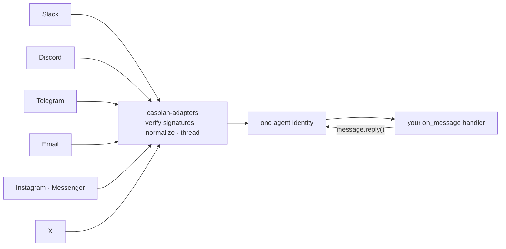

<p align="center">
  <picture>
    <source media="(prefers-color-scheme: dark)" srcset="assets/banner-dark.svg">
    
  </picture>
</p>

<p align="center">
  <a href="https://trycaspianai.com">Website</a>
  ·
  <a href="https://pypi.org/project/caspian-sdk/">PyPI</a>
  ·
  <a href="https://www.npmjs.com/package/caspian-sdk">npm</a>
  ·
  <a href="./llms.txt">llms.txt for agents</a>
  ·
  <a href="./CONTRIBUTING.md">Contributing</a>
  ·
  <a href="https://discord.gg/A28qnkvgCM">Discord</a>
</p>

<p align="center">
  <b>English</b> · <a href="./README.zh-CN.md">简体中文</a>
</p>

<p align="center">
  <a href="https://pypi.org/project/caspian-sdk/"></a>
  <a href="https://pepy.tech/project/caspian-sdk"></a>
  <a href="https://www.npmjs.com/package/caspian-sdk"></a>
  <a href="https://pypi.org/project/caspian-sdk/"></a>
  <a href="./LICENSE"></a>
  <a href="https://github.com/TryCaspian/caspian-sdk"></a>
  <a href="https://discord.gg/A28qnkvgCM"></a>
</p>

<p align="center">
  <strong>The largest OSS agent frameworks each built 25+ channel adapters — and still spend<br/>8–15% of their issue trackers on channel plumbing. Caspian makes it one handler.</strong>
</p>

<p align="center">
  
</p>

---

Your agent's reasoning decides **what** to say. Caspian is **how it exists** on **Slack, Discord, Telegram, Instagram, email, X**, and beyond — one connect call per channel, one handler for all of them, threading, webhook verification, and platform quirks handled.

## Get started in 30 seconds

**Building in a coding agent** (Claude Code, Codex, Cursor, Kimi, …)? Paste this — it reads the live guide and does the whole integration for you:

```text
Integrate Caspian so my agent can message people on email, Slack, Discord, Telegram, and more.
Read https://api.trycaspianai.com/SKILL.md and follow it end to end.
```

That's the fastest path — the guide at [`/SKILL.md`](https://api.trycaspianai.com/SKILL.md) is always current, so your agent installs the SDK, mints a key, connects a channel, and writes the handler itself.

**Or set it up by hand:**

```bash
cd your-project
pip install caspian-sdk        # the library (import into your code)
pipx install caspian-cli       # the CLI (gives the `caspian` command) — or: uvx caspian-cli
caspian init                   # mints a key, writes CASPIAN_API_KEY + CASPIAN_BASE_URL to .env
caspian connect email          # free, instant
```

Then in your code:

```python
from caspian_sdk import CommClient

client = CommClient()  # reads CASPIAN_API_KEY / CASPIAN_BASE_URL from .env
email = client.connect_email(username="example-agent")
print(f"Agent email: {email['address']}")
print("Listening (Ctrl+C to stop).")


@client.on_message
def handle(message):
    sender = (message.sender or {}).get("address", "?")
    print(f"<- {sender}: {message.text!r}")
    message.reply(f"You said: {message.text}")


client.listen()  # one loop, every channel
```

> **Node / TypeScript:** the library is `npm install caspian-sdk`. The `caspian` CLI is a
> standalone tool (Python) — run it with `uvx caspian-cli init` / `pipx install caspian-cli`,
> or just use the SDK directly (below); nothing else about the flow changes.

The SDK talks to the **hosted gateway at `https://api.trycaspianai.com`** by default (set `CASPIAN_BASE_URL` to point at a self-hosted one). **Free channels — email, Telegram, Slack, Discord — connect instantly, no sign-in.** Paid channels (X, WhatsApp, iMessage) prompt a one-time developer sign-in (`caspian login`, or `client.login()`) and run on prepaid credit you add in the dashboard.

**TypeScript** — same contract, zero runtime dependencies:

```ts
import { CommClient } from "caspian-sdk";

const client = new CommClient();  // reads CASPIAN_API_KEY / CASPIAN_BASE_URL
const inbox = await client.connectEmail({ username: "my-agent" });

client.onMessage(async (message) => {
  await message.reply(`You said: ${message.text}`);
});

await client.listen();
```

Adding a channel is one more `connect_*()` call — never new handler code.

## Delete your adapter layer

<table>
<tr>
<th>Without Caspian</th>
<th>With Caspian</th>
</tr>
<tr>
<td>

```python
# slack_bolt app + socket handler
# discord.py client + intents + reconnect
# python-telegram-bot + webhook server
# smtplib/imap polling + threading logic
# 4 auth flows, 4 payload shapes,
# 4 retry/backoff paths, 4 dedup caches,
# per-channel identity bugs...
# ~1,500 lines before your agent
# says a single word
```

</td>
<td>

```python
client.connect_email(...)
client.connect_telegram(...)
client.install_slack(...)
client.install_discord(...)

@client.on_message
def handle(message):
    message.reply(agent(message.text))

client.listen()
```

</td>
</tr>
</table>

> **Using a coding agent?** Point it at [`llms.txt`](./llms.txt) — or, against a running gateway, `GET /SKILL.md` — and it can do the entire integration for you.

## The problem

Every agent team ends up rebuilding the same four things — and none of them make the agent smarter.

**1. You own infrastructure you never wanted.** Writing the Slack bot is a weekend; owning it is forever. Session/auth desync, reconnect loops, silent connection failures, payload changes on every platform version bump. The pain isn't `send()` — sending is a solved call. The pain is the **lifecycle**. The largest OSS agent frameworks each maintain 25+ channel adapters in-tree and still spend 8–15% of their issue trackers on channel plumbing. (We measured 42 open-source agent projects before writing a line of this code.)

**2. Communication isn't part of your agent's decision-making.** With one-off, per-channel integrations, a developer decided at build time where and how the agent talks. The agent itself can't reason *"this deserves a quick Telegram ping now and an email summary afterwards"* — each channel is a separate bot with separate code and a separate identity. Communication stays hardcoded plumbing instead of becoming a capability the model can actually decide with.

**3. You maintain N identities for every one person.** The same human DMs your agent on Instagram today and emails it tomorrow. Now *your* database needs its own concept of "this is one person, one relationship, one running conversation" — who said what on which channel, and what should happen next in the flow. Every team rebuilds that continuity layer from scratch, per app, and it never stops needing care.

**4. A single-channel agent is a competitive disadvantage.** If a competing agent is reachable on five channels and yours on one, users go where they get answered. The open-source numbers show it: the agents people actually rely on are exactly the ones deployed across dozens of human channels — and that reach is exactly where their engineering time goes.

## Caspian's answer

**Channels are transports, not identities.** The agent is one identity; every channel binds to it through the same small adapter interface, and your handler code never learns which platform it's on. Messages arrive in one normalized conversation/message model regardless of transport, threading is owned by the layer, and `message.reply()` always answers in the right place — so cross-channel continuity lives in one place instead of five databases. Per-channel etiquette comes from `client.behavior_prompt()`, so *how to talk where* becomes something your model reasons about, not something you hardcode.



## Features

<table>
<tr>
<td width="50%" valign="top">

**🧵 One handler, every channel**<br/>
`message.reply()` answers in the right thread on whatever platform the message arrived from.

</td>
<td width="50%" valign="top">

**🔐 Webhook verification, always**<br/>
Slack signing secret, Meta `X-Hub-Signature-256`, Telegram secret header, X CRC, and signed email webhooks. Mismatches rejected.

</td>
</tr>
<tr>
<td valign="top">

**🎚 Capability negotiation**<br/>
Adapters declare what the channel can physically do; an agent can never be granted more than the transport supports.

</td>
<td valign="top">

**🧪 Offline fakes for every channel**<br/>
Fakes consume each platform's *real* payload shapes — 131 tests across Python + TS, zero network.

</td>
</tr>
<tr>
<td valign="top">

**⌨️ Typing indicators & instant acks**<br/>
Native "typing…" on Discord/Telegram; `listen(ack="On it…")` everywhere else.

</td>
<td valign="top">

**🧭 Behavior guides**<br/>
`client.behavior_prompt()` returns per-channel etiquette to drop into your system prompt.

</td>
</tr>
<tr>
<td valign="top">

**♻️ Idempotent connects**<br/>
Restart-safe: `connect_email()` returns the same inbox, never a duplicate.

</td>
<td valign="top">

**🔌 Pluggable registry**<br/>
Any provider package registers under the `caspian.providers` entry-point group. No forks.

</td>
</tr>
</table>

## Channels

| Channel | This repo (your credentials) | Caspian hosted |
|---|:---:|:---:|
|  &nbsp;Email | ✅ | ✅ instant inbox |
|  &nbsp;Telegram (bot) | ✅ | ✅ |
|  &nbsp;Discord | ✅ | ✅ one-click |
|  &nbsp;Slack | ✅ | ✅ one-click |
|  &nbsp;Instagram DM | ✅ | ✅ |
|  &nbsp;Facebook Messenger | ✅ | ✅ |
|  &nbsp;X / Twitter | ✅ * | ✅ |
| 📶 SMS (GSM modem) | ✅ * | ✅ no hardware |
|  &nbsp;Telegram (user account) | ⚠️ opt-in * | — |
|  &nbsp;WhatsApp Business | — | ✅ one-click |
|  &nbsp;Phone / voice · iMessage · RCS | — | ✅ |

<p align="center">
  <a href="https://trycaspianai.com"></a>
</p>

<details>
<summary><b>* The fine print</b> — read before you promise features</summary>
<br/>

- **X is not free**: DM send/receive needs a paid X API subscription on your X developer app (the free tier is write-only and capped).
- **Telegram user-account automation is ToS-gray**: it drives a personal account over MTProto and requires explicit opt-in config; bans are your risk. Never for spam.
- **GSM modem SMS**: your own modem + SIM; carrier compliance (A2P rules) is on you.

</details>

## Where to use it

If your agent needs to talk to humans, this is the layer under it:

- **Customer support agents** — answer on email, Slack, Instagram DM, or wherever the customer opened the thread; hand off to a human without dropping context.
- **Sales & lead follow-up** — first touch on the channel the lead used, follow-ups where they actually respond.
- **Personal / executive assistants** — one assistant identity across your email, Telegram, and Slack instead of three disconnected bots.
- **Community & product bots** — the same agent in your Discord, your Slack community, and members' DMs.
- **OpenClaw agents** — `clawhub install @trycaspian/caspian` ([the skill](./packages/clawhub-skill)) teaches your agent to wire itself up; [`openclaw-caspian`](./packages/openclaw) is the native channel plugin.
- **Fleets** — multi-tenant scoping gives each customer their own agent identity (see the recipe below).

Each of these is the same three lines: `connect_*()` the channels, write one `on_message` handler, `listen()`. Start from a [runnable example](./examples).

## Recipes

**Same agent, three channels:**

```python
client.connect_email(username="acme-support")
client.connect_telegram(bot_token=BOT_TOKEN)
slack = client.install_slack(display_name="Acme Support")
print("Add to Slack:", slack["authorize_url"])   # one click, then it's live
# the @client.on_message handler you already wrote now answers on all three
```

**Platform-aware replies** — teach the agent each channel's etiquette in one line:

```python
system_prompt += "\n\n" + client.behavior_prompt()
```

<details>
<summary><b>Multi-tenant</b> — one agent per customer, isolated by scope</summary>

```python
acme = client.create_customer("Acme")
agent = client.create_agent("Support")
client.connect_slack(customer_id=acme["id"], agent_id=agent["id"], ...)
```

</details>

<details>
<summary><b>Adapters without the SDK</b> — use the channel layer directly</summary>

```python
from caspian_adapters import Settings, build_providers

providers = build_providers(Settings(
    providers="instagram",
    instagram_page_id="<page id>",
    instagram_access_token="<page token>",
    instagram_app_secret="<app secret>",
))
```

</details>

## Rich messages

Send **one** provider-neutral `blocks` payload and every channel gets its best
possible rendering: Slack (Block Kit), Discord (embeds + buttons) and Telegram
(inline keyboards) render it natively, email gets rich HTML, and every text-only
channel (SMS, voice, and the rest) degrades to clean, readable text — automatically.
No per-channel branching in your handler.

A block is a plain dict/object (`{ "type": ... }`): `heading`, `text`, `divider`,
`image`, `fields`, `list`, `buttons`, `card`. A button with a `url` is a link; a
button with a `value` is a callback that renders as a tappable action where the
channel supports it, and as a "reply …" hint where it doesn't.

**Python:**

```python
from caspian_sdk import blocks as b

message.reply(blocks=[
    b.card(
        title="Order #1024 shipped",
        subtitle="Arriving Thursday",
        text="Your package is on the way.",
        buttons=[
            {"label": "Track package", "url": "https://example.com/track/1024"},
            {"label": "Get help", "value": "help:1024"},   # callback
        ],
    ),
])
```

**TypeScript:**

```typescript
import type { Block } from "caspian-sdk";

const blocks: Block[] = [
  {
    type: "card",
    title: "Order #1024 shipped",
    subtitle: "Arriving Thursday",
    text: "Your package is on the way.",
    buttons: [
      { label: "Track package", url: "https://example.com/track/1024" },
      { label: "Get help", value: "help:1024" }, // callback
    ],
  },
];

await message.reply(undefined, undefined, blocks);
// or proactively: await client.sendMessage(conversationId, null, null, blocks);
```

Blocks work anywhere text does — `message.reply(...)`, `send_message(...)` /
`sendMessage(...)`. Pass `text` too and it's used as the fallback on channels
that can't render blocks; omit it and a clean text fallback is generated for you.

## Streaming

Caspian supports streaming responses natively. When you stream a message to a channel, the SDK automatically determines the best strategy based on the platform's capabilities:
- **`post_edit` (Native Streaming)**: On platforms that support rapid message edits (like Discord, Slack, and Telegram), the SDK will post an initial message and continuously edit it as new chunks arrive, giving a true typing-like experience.
- **`final_only` (Fallback)**: On immutable platforms (like Email, SMS, or X/Twitter), the SDK automatically buffers the stream and sends only the final complete message once the stream finishes, preventing fragmented or spammy messages.

## What's in this repo

| Package | |
|---|---|
| [`packages/adapters`](./packages/adapters) | `caspian-adapters` — the channel adapters. One small interface per platform (`provision` / `send` / `reply` / `parse_webhook`), real signature verification, an offline fake per channel. |
| [`sdks/python`](./sdks/python) | `caspian-sdk` (PyPI) — the Python client: `on_message`, `connect_*()`, `message.reply()`, behavior guides. |
| [`sdks/typescript`](./sdks/typescript) | `caspian-sdk` (npm) — the TypeScript client: same contract, camelCase API, zero runtime deps, Node 18+. |
| [`packages/openclaw`](./packages/openclaw) | `openclaw-caspian` — OpenClaw channel plugin: one install gives an OpenClaw agent every Caspian channel. |
| [`packages/clawhub-skill`](./packages/clawhub-skill) | The ClawHub skill (`clawhub install @trycaspian/caspian`) — publishes the live gateway SKILL.md. |
| [`apps/cli`](./apps/cli) | `caspian` — init a project, connect channels, tail events from your terminal. |
| [`examples`](./examples) | Minimal runnable agents. |

## Starter templates

Ready-to-run repos — click "Use this template", add a token, and your agent is live on the channel:

| Template | Channel | Language |
|---|---|---|
| [`telegram-ai-agent-template`](https://github.com/TryCaspian/telegram-ai-agent-template) | Telegram | Python |
| [`discord-ai-agent-template`](https://github.com/TryCaspian/discord-ai-agent-template) | Discord | Python |
| [`slack-ai-agent-template`](https://github.com/TryCaspian/slack-ai-agent-template) | Slack | Python |
| [`email-ai-agent-template`](https://github.com/TryCaspian/email-ai-agent-template) | Email (instant inbox) | Node.js |
| [`openclaw-telegram-agent`](https://github.com/TryCaspian/openclaw-telegram-agent) | OpenClaw + Telegram | guide |

## Roadmap

- **MCP server** — connect and message channels straight from any MCP-capable agent
- **Reddit & LinkedIn adapters** — next channels in the pipeline
- **Agent-native payments** — pay-as-you-go via API, x402-ready, no dashboard
- **More adapters** — the interface is small on purpose; [add one](./CONTRIBUTING.md#adding-a-new-channel-adapter)

## Community & support

- **Questions, ideas, show & tell** — [GitHub Discussions](https://github.com/TryCaspian/caspian-sdk/discussions)
- **Bugs** — [GitHub issues](https://github.com/TryCaspian/caspian-sdk/issues)
- **Security** — see [SECURITY.md](./SECURITY.md) (please, no public issues for vulnerabilities)
- **Hosted product & contact** — [trycaspianai.com](https://trycaspianai.com)

## Development

```bash
git clone https://github.com/TryCaspian/caspian-sdk.git
cd caspian-sdk && uv sync
uv run pytest        # 100 Python tests, all offline
uv run ruff check .
cd sdks/typescript && npm ci && npm test   # 31 vitest tests
```

Contributions welcome — see [CONTRIBUTING.md](./CONTRIBUTING.md).

**If Caspian saved you time, [a star](https://github.com/TryCaspian/caspian-sdk/stargazers) helps other agent builders find it.** ⭐

## License

Apache-2.0 for this repository. The `caspian-sdk` package on PyPI is MIT.
