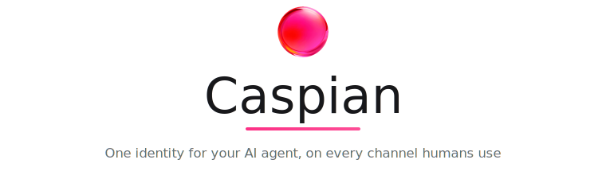
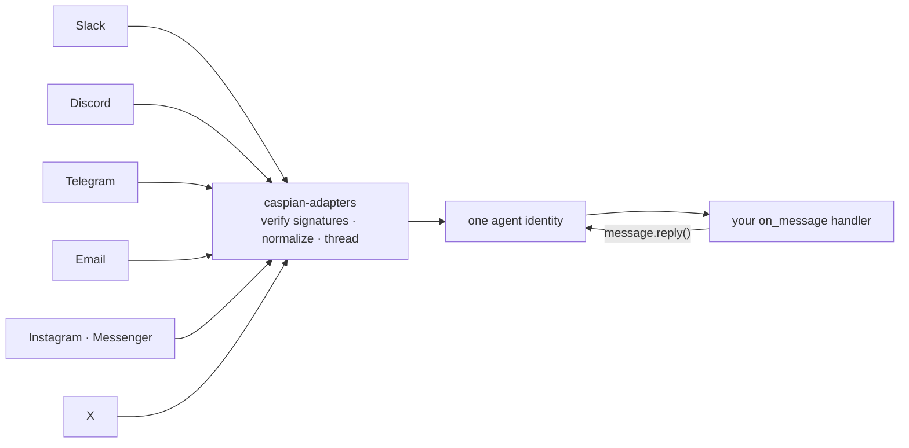

<p align="center">
  <picture>
    <source media="(prefers-color-scheme: dark)" srcset="assets/banner-dark.svg">
    
  </picture>
</p>

<p align="center">
  <a href="https://trycaspianai.com">Website</a>
  ·
  <a href="https://pypi.org/project/caspian-sdk/">PyPI</a>
  ·
  <a href="https://www.npmjs.com/package/caspian-sdk">npm</a>
  ·
  <a href="./llms.txt">llms.txt for agents</a>
  ·
  <a href="./CONTRIBUTING.md">Contributing</a>
</p>

<p align="center">
  <a href="https://pypi.org/project/caspian-sdk/"></a>
  <a href="https://pepy.tech/project/caspian-sdk"></a>
  <a href="https://www.npmjs.com/package/caspian-sdk"></a>
  <a href="https://pypi.org/project/caspian-sdk/"></a>
  <a href="./LICENSE"></a>
  <a href="https://github.com/TryCaspian/caspian-sdk"></a>
</p>

<p align="center">
  <strong>The largest OSS agent frameworks each built 25+ channel adapters — and still spend<br/>8–15% of their issue trackers on channel plumbing. Caspian makes it one handler.</strong>
</p>

<p align="center">
  
</p>

---

Your agent's reasoning decides **what** to say. Caspian is **how it exists** on **Slack, Discord, Telegram, Instagram, email, X**, and beyond — one connect call per channel, one handler for all of them, threading, webhook verification, and platform quirks handled.

```bash
pip install caspian-sdk      # Python
npm install caspian-sdk      # TypeScript / Node 18+
```

**Python:**

```python
from caspian_sdk import CommClient

client = CommClient()  # reads COMM_API_KEY / COMM_BASE_URL from .env
email = client.connect_email(display_name="My Agent")
print("Agent email:", email["address"])

@client.on_message
def handle(message):
    message.reply(f"You said: {message.text}")

client.listen()  # one loop, every channel
```

**TypeScript** — same contract, zero runtime dependencies:

```ts
import { CommClient } from "caspian-sdk";

const client = new CommClient();  // reads COMM_API_KEY / COMM_BASE_URL
const inbox = await client.connectEmail({ displayName: "My Agent" });

client.onMessage(async (message) => {
  await message.reply(`You said: ${message.text}`);
});

await client.listen();
```

Adding a channel is one more `connect_*()` call — never new handler code.

## Delete your adapter layer

<table>
<tr>
<th>Without Caspian</th>
<th>With Caspian</th>
</tr>
<tr>
<td>

```python
# slack_bolt app + socket handler
# discord.py client + intents + reconnect
# python-telegram-bot + webhook server
# smtplib/imap polling + threading logic
# 4 auth flows, 4 payload shapes,
# 4 retry/backoff paths, 4 dedup caches,
# per-channel identity bugs...
# ~1,500 lines before your agent
# says a single word
```

</td>
<td>

```python
client.connect_email(...)
client.connect_telegram(...)
client.install_slack(...)
client.install_discord(...)

@client.on_message
def handle(message):
    message.reply(agent(message.text))

client.listen()
```

</td>
</tr>
</table>

> **Using a coding agent?** Point it at [`llms.txt`](./llms.txt) — or, against a running gateway, `GET /SKILL.md` — and it can do the entire integration for you.

## Why Caspian exists

The pain isn't `send()` — it's **lifecycle and identity**: session/auth desync, reconnect loops, silent connection failures, cross-channel identity bugs. We measured it across 42 open-source agent projects before writing a line of this code.

Caspian's answer: **channels are transports, not identities.** The agent is one identity; every channel binds to it through the same small adapter interface, and your handler code never learns which platform it's on.



## Features

<table>
<tr>
<td width="50%" valign="top">

**🧵 One handler, every channel**<br/>
`message.reply()` answers in the right thread on whatever platform the message arrived from.

</td>
<td width="50%" valign="top">

**🔐 Webhook verification, always**<br/>
Slack signing secret, Meta `X-Hub-Signature-256`, Telegram secret header, X CRC, SES/SNS. Mismatches rejected.

</td>
</tr>
<tr>
<td valign="top">

**🎚 Capability negotiation**<br/>
Adapters declare what the channel can physically do; an agent can never be granted more than the transport supports.

</td>
<td valign="top">

**🧪 Offline fakes for every channel**<br/>
Fakes consume each platform's *real* payload shapes — 80 tests across Python + TS, zero network.

</td>
</tr>
<tr>
<td valign="top">

**⌨️ Typing indicators & instant acks**<br/>
Native "typing…" on Discord/Telegram; `listen(ack="On it…")` everywhere else.

</td>
<td valign="top">

**🧭 Behavior guides**<br/>
`client.behavior_prompt()` returns per-channel etiquette to drop into your system prompt.

</td>
</tr>
<tr>
<td valign="top">

**♻️ Idempotent connects**<br/>
Restart-safe: `connect_email()` returns the same inbox, never a duplicate.

</td>
<td valign="top">

**🔌 Pluggable registry**<br/>
Any provider package registers under the `caspian.providers` entry-point group. No forks.

</td>
</tr>
</table>

## Channels

| Channel | This repo (your credentials) | Caspian hosted |
|---|:---:|:---:|
|  &nbsp;Email (AWS SES) | ✅ | ✅ instant inbox |
|  &nbsp;Telegram (bot) | ✅ | ✅ |
|  &nbsp;Discord | ✅ | ✅ one-click |
|  &nbsp;Slack | ✅ | ✅ one-click |
|  &nbsp;Instagram DM | ✅ | ✅ |
|  &nbsp;Facebook Messenger | ✅ | ✅ |
|  &nbsp;X / Twitter | ✅ * | ✅ |
|  &nbsp;Google Meet | ✅ | ✅ |
| 📶 SMS (GSM modem) | ✅ * | ✅ no hardware |
|  &nbsp;Telegram (user account) | ⚠️ opt-in * | — |
|  &nbsp;WhatsApp Business | — | ✅ one-click |
|  &nbsp;Phone / voice · iMessage · RCS | — | ✅ |

<p align="center">
  <a href="https://trycaspianai.com"></a>
</p>

<details>
<summary><b>* The fine print</b> — read before you promise features</summary>
<br/>

- **X is not free**: DM send/receive needs a paid X API subscription on your X developer app (the free tier is write-only and capped).
- **Telegram user-account automation is ToS-gray**: it drives a personal account over MTProto and requires explicit opt-in config; bans are your risk. Never for spam.
- **GSM modem SMS**: your own modem + SIM; carrier compliance (A2P rules) is on you.

</details>

## Recipes

**Same agent, three channels:**

```python
client.connect_email(display_name="Acme Support")
client.connect_telegram(bot_token=BOT_TOKEN)
slack = client.install_slack(display_name="Acme Support")
print("Add to Slack:", slack["authorize_url"])   # one click, then it's live
# the @client.on_message handler you already wrote now answers on all three
```

**Platform-aware replies** — teach the agent each channel's etiquette in one line:

```python
system_prompt += "\n\n" + client.behavior_prompt()
```

<details>
<summary><b>Multi-tenant</b> — one agent per customer, isolated by scope</summary>

```python
acme = client.create_customer("Acme")
agent = client.create_agent("Support")
client.connect_slack(customer_id=acme["id"], agent_id=agent["id"], ...)
```

</details>

<details>
<summary><b>Adapters without the SDK</b> — use the channel layer directly</summary>

```python
from caspian_adapters import Settings, build_providers

providers = build_providers(Settings(
    providers="instagram",
    instagram_page_id="<page id>",
    instagram_access_token="<page token>",
    instagram_app_secret="<app secret>",
))
```

</details>

## What's in this repo

| Package | |
|---|---|
| [`packages/adapters`](./packages/adapters) | `caspian-adapters` — the channel adapters. One small interface per platform (`provision` / `send` / `reply` / `parse_webhook`), real signature verification, an offline fake per channel. |
| [`sdks/python`](./sdks/python) | `caspian-sdk` (PyPI) — the Python client: `on_message`, `connect_*()`, `message.reply()`, behavior guides. |
| [`sdks/typescript`](./sdks/typescript) | `caspian-sdk` (npm) — the TypeScript client: same contract, camelCase API, zero runtime deps, Node 18+. |
| [`apps/cli`](./apps/cli) | `comm` — init a project, connect channels, tail events from your terminal. |
| [`examples`](./examples) | Minimal runnable agents. |

## Roadmap

- **MCP server** — connect and message channels straight from any MCP-capable agent
- **More adapters** — the interface is small on purpose; [add one](./CONTRIBUTING.md#adding-a-new-channel-adapter)

## Community & support

- **Bugs / ideas** — [GitHub issues](https://github.com/TryCaspian/caspian-sdk/issues)
- **Security** — see [SECURITY.md](./SECURITY.md) (please, no public issues for vulnerabilities)
- **Hosted product & contact** — [trycaspianai.com](https://trycaspianai.com)

## Development

```bash
git clone https://github.com/TryCaspian/caspian-sdk.git
cd caspian-sdk && uv sync
uv run pytest        # 70 tests, all offline
uv run ruff check .
```

Contributions welcome — see [CONTRIBUTING.md](./CONTRIBUTING.md).

**If Caspian saved you time, [a star](https://github.com/TryCaspian/caspian-sdk/stargazers) helps other agent builders find it.** ⭐

## License

Apache-2.0 for this repository. The `caspian-sdk` package on PyPI is MIT.
