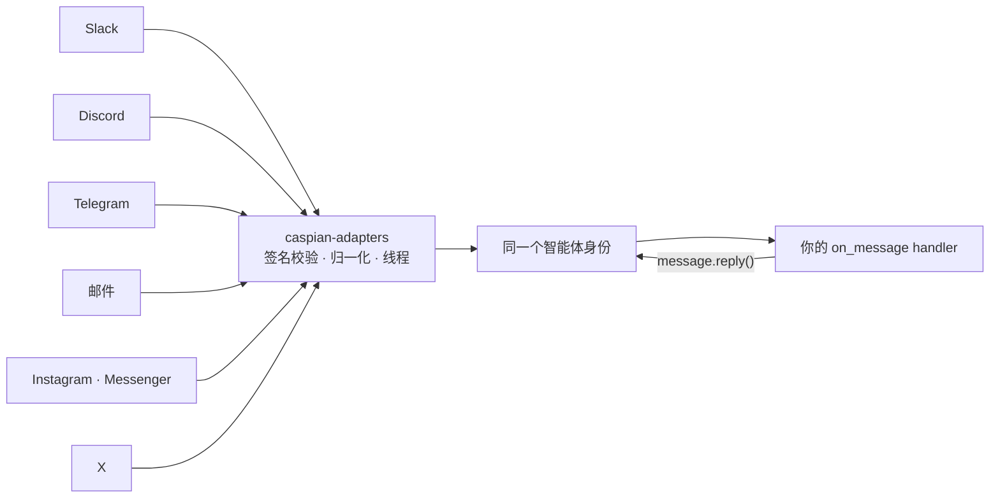

<p align="center">
  <picture>
    <source media="(prefers-color-scheme: dark)" srcset="assets/banner-dark.svg">
    
  </picture>
</p>

<p align="center">
  <a href="https://trycaspianai.com">官网</a>
  ·
  <a href="https://pypi.org/project/caspian-sdk/">PyPI</a>
  ·
  <a href="https://www.npmjs.com/package/caspian-sdk">npm</a>
  ·
  <a href="./llms.txt">面向 AI 编程助手的 llms.txt</a>
  ·
  <a href="./CONTRIBUTING.md">参与贡献</a>
  ·
  <a href="https://discord.gg/A28qnkvgCM">Discord</a>
</p>

<p align="center">
  <a href="./README.md">English</a> · <b>简体中文</b>
</p>

<p align="center">
  <a href="https://pypi.org/project/caspian-sdk/"></a>
  <a href="https://pepy.tech/project/caspian-sdk"></a>
  <a href="https://www.npmjs.com/package/caspian-sdk"></a>
  <a href="https://pypi.org/project/caspian-sdk/"></a>
  <a href="./LICENSE"></a>
  <a href="https://github.com/TryCaspian/caspian-sdk"></a>
  <a href="https://discord.gg/A28qnkvgCM"></a>
</p>

<p align="center">
  <strong>最大的开源智能体框架各自造了 25 个以上的渠道适配器——但 issue 列表里仍有 8–15% 是渠道管道问题。<br/>Caspian 把这一切收敛为一个 handler。</strong>
</p>

<p align="center">
  
</p>

---

你的智能体的推理决定**说什么**。Caspian 决定它**如何存在**于 **Slack、Discord、Telegram、Instagram、邮件、X** 等每一个渠道上——每个渠道一次 connect 调用，所有渠道共用一个 handler，线程回复与 webhook 签名校验全部内置。

```bash
pip install caspian-sdk      # Python
npm install caspian-sdk      # TypeScript / Node 18+
```

**Python：**

```python
from caspian_sdk import CommClient

client = CommClient()  # 从 .env 读取 CASPIAN_API_KEY / CASPIAN_BASE_URL
email = client.connect_email(display_name="My Agent")
print("Agent email:", email["address"])

@client.on_message
def handle(message):
    message.reply(f"You said: {message.text}")

client.listen()  # 一个循环，覆盖所有渠道
```

**TypeScript**——同一套契约，零运行时依赖：

```ts
import { CommClient } from "caspian-sdk";

const client = new CommClient();  // 读取 CASPIAN_API_KEY / CASPIAN_BASE_URL
const inbox = await client.connectEmail({ displayName: "My Agent" });

client.onMessage(async (message) => {
  await message.reply(`You said: ${message.text}`);
});

await client.listen();
```

新增一个渠道只是多一次 `connect_*()` 调用——永远不用写新的 handler 代码。

## 删掉你的适配器层

<table>
<tr>
<th>没有 Caspian</th>
<th>用 Caspian</th>
</tr>
<tr>
<td>

```python
# slack_bolt 应用 + socket 处理
# discord.py 客户端 + intents + 重连
# python-telegram-bot + webhook 服务
# smtplib/imap 轮询 + 线程逻辑
# 4 套鉴权流程、4 种消息格式、
# 4 条重试/退避路径、4 个去重缓存、
# 跨渠道身份 bug……
# 在你的智能体说出第一句话之前，
# 先写约 1500 行管道代码
```

</td>
<td>

```python
client.connect_email(...)
client.connect_telegram(...)
client.install_slack(...)
client.install_discord(...)

@client.on_message
def handle(message):
    message.reply(agent(message.text))

client.listen()
```

</td>
</tr>
</table>

> **在用 AI 编程助手？** 把 [`llms.txt`](./llms.txt) 喂给它——或者对着运行中的网关 `GET /SKILL.md`——它就能替你完成整个接入。

## 问题所在

每个智能体团队最终都在重复造同样的四个轮子——而它们没有一个能让智能体变得更聪明。

**1. 你背上了从没想要的基础设施。** 写一个 Slack 机器人只要一个周末，养它却是一辈子的事：会话/鉴权失步、断线重连循环、静默的连接失败、平台每次升版带来的 payload 变化。痛点从来不是 `send()`——发送早已是被解决的一次调用，痛的是**生命周期**。最大的几个开源智能体框架各自在仓库里维护着 25+ 个渠道适配器，issue 区仍有 8–15% 被渠道管道问题占据。（在写下第一行代码之前，我们对 42 个开源智能体项目做了量化调研。）

**2. 沟通不在智能体的决策范围之内。** 一对一硬编码的渠道集成，意味着“在哪说、怎么说”是开发者在构建时定死的。智能体自己无法推理“这件事应该现在发条 Telegram 快讯，稍后再补一封邮件总结”——每个渠道都是一个独立的机器人、独立的代码、独立的身份。沟通始终是写死的管道，而不是模型可以真正决策的能力。

**3. 每一个人，你都要维护 N 份身份。** 同一个人今天在 Instagram 上私信你的智能体，明天又发来邮件。于是*你的*数据库必须自己发明“这是同一个人、同一段关系、同一场进行中的对话”这个概念——谁在哪个渠道说了什么，流程接下来该怎么走。每个团队都在从零重建这层连续性，按平台各写一份，而且永远维护不完。

**4. 单渠道智能体在竞争中就是劣势。** 如果竞品的智能体在五个渠道都能被找到，而你的只有一个，用户会去有回应的那边。开源数据也印证了这一点：人们真正依赖的智能体，恰恰是部署在几十个人类渠道上的那些——而这份触达能力，恰恰吞掉了它们的工程时间。

## Caspian 的答案

**渠道是传输层，不是身份。** 智能体是同一个身份；每个渠道都通过同一个小巧的适配器接口绑定到它，你的 handler 代码永远不需要知道自己在哪个平台上。无论来自哪种传输，消息都以同一套归一化的会话/消息模型到达，线程由这一层负责，`message.reply()` 永远回到正确的位置——跨渠道的连续性只存在于一个地方，而不是五个数据库。每个渠道的沟通礼仪由 `client.behavior_prompt()` 提供，“在哪该怎么说”从此是模型可以推理的对象，而不是你硬编码的逻辑。



## 功能特性

<table>
<tr>
<td width="50%" valign="top">

**🧵 一个 handler，所有渠道**<br/>
`message.reply()` 自动在消息来源平台的正确线程里回复。

</td>
<td width="50%" valign="top">

**🔐 Webhook 校验，永不缺席**<br/>
Slack signing secret、Meta `X-Hub-Signature-256`、Telegram secret header、X CRC、签名邮件回调。签名不符一律拒绝。

</td>
</tr>
<tr>
<td valign="top">

**🎚 能力协商**<br/>
适配器声明渠道物理上支持的能力；智能体永远不会被授予超出传输层支持的权限。

</td>
<td valign="top">

**🧪 每个渠道的离线 fake**<br/>
fake 消费各平台*真实*的入站消息格式——Python + TS 共 171 个测试，零网络请求。

</td>
</tr>
<tr>
<td valign="top">

**⌨️ 输入指示与即时回执**<br/>
Discord/Telegram 原生"正在输入…"；其他渠道用 `listen(ack="收到，稍等…")`。

</td>
<td valign="top">

**🧭 平台行为指南**<br/>
`client.behavior_prompt()` 返回各渠道的礼仪规范，直接注入你的系统提示词。

</td>
</tr>
<tr>
<td valign="top">

**♻️ 幂等连接**<br/>
重启安全：`connect_email()` 返回同一个收件箱，绝不重复创建。

</td>
<td valign="top">

**🔌 可插拔注册表**<br/>
任何 provider 包都可以通过 `caspian.providers` entry-point 注册。无需 fork。

</td>
</tr>
</table>

## 渠道

| 渠道 | 本仓库（自带凭证） | Caspian 托管 |
|---|:---:|:---:|
|  &nbsp;邮件 | ✅ | ✅ 即时收件箱 |
|  &nbsp;Telegram（机器人） | ✅ | ✅ |
|  &nbsp;Discord | ✅ | ✅ 一键安装 |
|  &nbsp;Slack | ✅ | ✅ 一键安装 |
|  &nbsp;Instagram 私信 | ✅ | ✅ |
|  &nbsp;Facebook Messenger | ✅ | ✅ |
|  &nbsp;X / Twitter | ✅ * | ✅ |
|  &nbsp;Google Meet | ✅ | ✅ |
| 📶 短信（GSM 模块） | ✅ * | ✅ 无需硬件 |
|  &nbsp;Telegram（个人账号） | ⚠️ 需显式开启 * | — |
|  &nbsp;WhatsApp Business | — | ✅ 一键接入 |
|  &nbsp;电话 / 语音 · iMessage · RCS | — | ✅ |

<p align="center">
  <a href="https://trycaspianai.com"></a>
</p>

托管渠道使用完全相同的 API——不用买号码，不用过平台审核：**[trycaspianai.com](https://trycaspianai.com)**。任何 provider 包都能通过 `caspian.providers` entry-point 接入同一个注册表。

<details>
<summary><b>* 注意事项</b>——在向别人承诺功能之前请先读一遍</summary>
<br/>

- **X 不是免费渠道**：私信收发需要你的 X 开发者应用开通付费 API 订阅（免费档只写不读且限额很低）。
- **Telegram 个人账号自动化处于 ToS 灰色地带**：它通过 MTProto 驱动个人账号，需要显式开启配置；封号风险自负。绝不可用于骚扰信息。
- **GSM 模块短信**：需要你自己的模块和 SIM 卡；运营商合规（A2P 规则）由你负责。

</details>

## 适用场景

只要你的智能体需要和人对话，它下面就该是这一层：

- **客服智能体** —— 在邮件、Slack、Instagram 私信，或客户打开对话的任何地方作答；转接人工时不丢上下文。
- **销售与线索跟进** —— 首次触达用线索所在的渠道，后续跟进去他们真正回复的地方。
- **个人 / 高管助理** —— 一个助理身份贯通你的邮件、Telegram 和 Slack，而不是三个互不相认的机器人。
- **社区与产品机器人** —— 同一个智能体出现在你的 Discord、Slack 社区和成员的私信里。
- **OpenClaw 智能体** —— [`openclaw-caspian`](./packages/openclaw) 一次插件安装，获得全部 Caspian 渠道。
- **智能体舰队** —— 多租户作用域让每个客户拥有自己的智能体身份（见下方示例）。

以上每一种都是同样的三行代码：`connect_*()` 连接渠道，写一个 `on_message` handler，然后 `listen()`。可以从[可运行示例](./examples)开始。

## 使用示例

**同一个智能体，三个渠道：**

```python
client.connect_email(display_name="Acme Support")
client.connect_telegram(bot_token=BOT_TOKEN)
slack = client.install_slack(display_name="Acme Support")
print("Add to Slack:", slack["authorize_url"])   # 一次点击即上线
# 你已经写好的 @client.on_message handler 现在同时服务三个渠道
```

**让回复适配平台**——一行代码教会智能体每个渠道的礼仪：

```python
system_prompt += "\n\n" + client.behavior_prompt()
```

<details>
<summary><b>多租户</b>——每个客户一个智能体，按作用域隔离</summary>

```python
acme = client.create_customer("Acme")
agent = client.create_agent("Support")
client.connect_slack(customer_id=acme["id"], agent_id=agent["id"], ...)
```

</details>

<details>
<summary><b>不经过 SDK 直接使用适配器</b></summary>

```python
from caspian_adapters import Settings, build_providers

providers = build_providers(Settings(
    providers="instagram",
    instagram_page_id="<page id>",
    instagram_access_token="<page token>",
    instagram_app_secret="<app secret>",
))
```

</details>

## 仓库结构

| 包 | |
|---|---|
| [`packages/adapters`](./packages/adapters) | `caspian-adapters`——渠道适配器。每个平台一个小巧接口（`provision` / `send` / `reply` / `parse_webhook`），真实的签名校验，每个渠道配一个离线 fake。 |
| [`sdks/python`](./sdks/python) | `caspian-sdk`（PyPI）——Python 客户端：`on_message`、`connect_*()`、`message.reply()`、行为指南。 |
| [`sdks/typescript`](./sdks/typescript) | `caspian-sdk`（npm）——TypeScript 客户端：同一契约，camelCase API，零运行时依赖，Node 18+。 |
| [`apps/cli`](./apps/cli) | `caspian`——在终端里初始化项目、连接渠道、追踪事件。 |
| [`examples`](./examples) | 最小可运行示例。 |

## 路线图

- **MCP 服务器**——任何支持 MCP 的智能体都能直接连接和收发渠道消息
- **Reddit 与 LinkedIn 适配器**——下一批渠道
- **智能体原生支付**——纯 API 的按量付费，兼容 x402，没有任何管理后台
- **更多适配器**——接口刻意保持小巧；[来加一个](./CONTRIBUTING.md#adding-a-new-channel-adapter)

## 社区与支持

- **提问、想法、作品展示**——[GitHub Discussions](https://github.com/TryCaspian/caspian-sdk/discussions)
- **Bug**——[GitHub issues](https://github.com/TryCaspian/caspian-sdk/issues)
- **安全问题**——见 [SECURITY.md](./SECURITY.md)（请勿公开提交漏洞 issue）
- **托管产品与联系**——[trycaspianai.com](https://trycaspianai.com)

## 开发

```bash
git clone https://github.com/TryCaspian/caspian-sdk.git
cd caspian-sdk && uv sync
uv run pytest        # 126 个 Python 测试，全部离线
uv run ruff check .
cd sdks/typescript && npm ci && npm test   # 45 个 vitest 测试
```

欢迎贡献——见 [CONTRIBUTING.md](./CONTRIBUTING.md)。

**如果 Caspian 帮你省了时间，[一颗 star](https://github.com/TryCaspian/caspian-sdk/stargazers) 能帮助更多智能体开发者找到它。** ⭐

## 许可证

本仓库使用 Apache-2.0。PyPI 上的 `caspian-sdk` 包使用 MIT。
