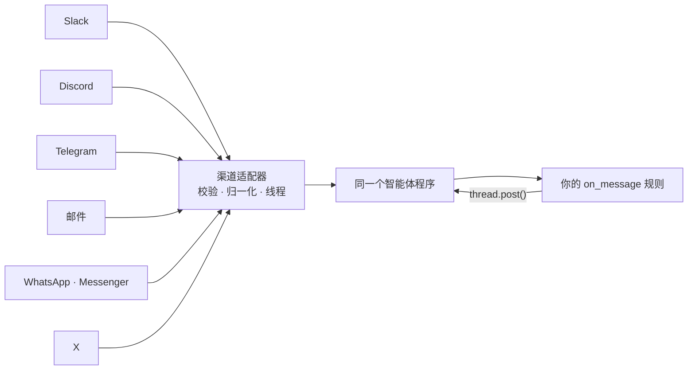

<p align="center">
  <picture>
    <source media="(prefers-color-scheme: dark)" srcset="assets/banner-dark.svg">
    
  </picture>
</p>

<p align="center">
  <a href="https://trycaspianai.com">官网</a>
  ·
  <a href="https://pypi.org/project/caspian-sdk/">PyPI</a>
  ·
  <a href="https://www.npmjs.com/package/caspian-sdk">npm</a>
  ·
  <a href="https://api.trycaspianai.com/SKILL.md">面向 AI 编程助手的 SKILL.md</a>
  ·
  <a href="./CONTRIBUTING.md">参与贡献</a>
</p>

<p align="center">
  <a href="./README.md">English</a> · <b>简体中文</b>
</p>

<p align="center">
  <a href="https://github.com/TryCaspian/caspian-sdk/actions/workflows/ci.yml"></a>
  <a href="https://pypi.org/project/caspian-sdk/"></a>
  <a href="https://pepy.tech/project/caspian-sdk"></a>
  <a href="https://www.npmjs.com/package/caspian-sdk"></a>
  <a href="https://pypi.org/project/caspian-sdk/"></a>
  <a href="./LICENSE"></a>
  <a href="https://github.com/TryCaspian/caspian-sdk"></a>
</p>

<p align="center">
  <strong>最大的开源智能体框架各自造了 25 个以上的渠道适配器——但 issue 列表里仍有 8–15% 是渠道管道问题。<br/>Caspian 把这一切收敛为一个 handler。</strong>
</p>

<p align="center">
  
</p>

---

你的智能体的推理决定**说什么**。Caspian 决定它**如何存在**于 **Slack、Discord、Telegram、邮件、WhatsApp、X、Linear** 等每一个渠道上——每个渠道一次 `channels.add()`，所有渠道共用一套声明式规则，线程回复与 webhook 签名校验全部内置。

**1.0 版本**是一次完整重写。公开 API 为 `Caspian`（不再是 0.6.x 的 legacy `CommClient`）。见下方[从 0.6.x 迁移](#从-06x-迁移)。

## 30 秒上手

**在用 AI 编程助手？** 粘贴下面这段——它会读取实时指南并完成整个接入：

```text
Integrate Caspian so my agent can message people on email, Slack, Discord, Telegram, and more.
Read https://api.trycaspianai.com/SKILL.md and follow it end to end.
```

**或手动安装：**

```bash
pip install caspian-sdk      # Python 3.10+
npm install caspian-sdk      # TypeScript / Node 18+ / Bun
```

在 [dashboard.trycaspianai.com](https://dashboard.trycaspianai.com) 获取 API Key，然后：

**托管模式** — 网关负责入站，你的进程轮询事件：

```python
from caspian import Caspian

cx = Caspian(api_key="...")                          # 或 .env 中的 CASPIAN_API_KEY
cx.channels.add("telegram", bot_token="...")         # Telegram 需自备 BotFather token

@cx.on_message({"overlap": "queue", "ack": "收到，稍等…"})
def handle(thread, msg, ctx):
    thread.post(f"你说：{msg.text}")

cx.run()   # 轮询网关 — Ctrl+C 停止
```

**自托管** — 你的进程、你的 token、无需网关轮询：

```python
cx = Caspian()
cx.channels.add("telegram", via="self-host", bot_token="...",
                webhook_url="https://your.server/telegram")

@cx.on_message({"channel": "telegram"})
def handle(thread, msg, ctx):
    thread.post(f"你说：{msg.text}")

# 在你的 HTTP 路由中：
results = cx.handle("telegram", request_body, request_headers)
```

Discord 和 Slack 可通过长连接 socket 接收消息，无需公网 URL — `cx.listen("discord")`（需可选依赖 `caspian-sdk[discord]`）。

**TypeScript** — 同一套契约：

```ts
import { Caspian } from "caspian-sdk"

const cx = new Caspian()

await cx.channels.add("telegram", {
  via: "self-host",
  botToken: process.env.TELEGRAM_BOT_TOKEN!,
  webhookUrl: "https://your.server/telegram",
})

cx.onMessage({ channel: "telegram", overlap: "queue" }, async (thread, msg) => {
  await thread.post(`你说：${msg.text}`)
})

// POST webhook 路由 → cx.webhooks.telegram(req)
```

新增渠道只需多一次 `channels.add()` — handler 规则不变。

### CLI

重写版 CLI 位于 [`packages/cli`](./packages/cli)（TypeScript + Bun）。它是同一 SDK 表面的薄客户端 — catalog 发现能力，`call` 执行操作：

```bash
caspian init                 # 生成 key → ~/.caspian/.env 或项目 .env
caspian channels add telegram
caspian channels add telegram --via self-host --bot-token "$TG" \
  --webhook-url https://myapp.example.com/hook
caspian call post --thread telegram:123:456 --text "已发货"
caspian threads tail telegram:123:456
```

完整命令说明见 [`packages/cli/README.md`](./packages/cli/README.md)。

## 删掉你的适配器层

<table>
<tr>
<th>没有 Caspian</th>
<th>用 Caspian</th>
</tr>
<tr>
<td>

```python
# slack_bolt 应用 + socket 处理
# discord.py 客户端 + intents + 重连
# python-telegram-bot + webhook 服务
# smtplib/imap 轮询 + 线程逻辑
# 4 套鉴权流程、4 种消息格式、
# 4 条重试/退避路径、4 个去重缓存、
# 跨渠道身份 bug……
# 在你的智能体说出第一句话之前，
# 先写约 1500 行管道代码
```

</td>
<td>

```python
cx.channels.add("email", via="self-host", ...)
cx.channels.add("telegram", via="self-host", bot_token=TG, webhook_url=URL)
cx.channels.add("slack", via="self-host", bot_token=SLACK, ...)

@cx.on_message({"overlap": "queue"})
def handle(thread, msg, ctx):
    thread.post(agent(msg.text))

cx.run()          # 托管
# 或 cx.listen("slack") / cx.handle(channel, body, headers)
```

</td>
</tr>
</table>

> **在用 AI 编程助手？** 把 [`SKILL.md`](https://api.trycaspianai.com/SKILL.md) 喂给它——它就能替你完成整个接入。

## 问题所在

每个智能体团队最终都在重复造同样的四个轮子——而它们没有一个能让智能体变得更聪明。

**1. 你背上了从没想要的基础设施。** 写一个 Slack 机器人只要一个周末，养它却是一辈子的事：会话/鉴权失步、断线重连循环、静默的连接失败、平台每次升版带来的 payload 变化。痛点从来不是 `send()`——发送早已是被解决的一次调用，痛的是**生命周期**。

**2. 沟通不在智能体的决策范围之内。** 一对一硬编码的渠道集成，意味着"在哪说、怎么说"是开发者在构建时定死的。智能体自己无法推理"这件事应该现在发条 Telegram 快讯，稍后再补一封邮件总结"。

**3. 每一个人，你都要维护 N 份身份。** 同一个人今天在 Instagram 上私信你的智能体，明天又发来邮件。于是*你的*数据库必须自己发明"这是同一个人、同一段关系、同一场进行中的对话"这个概念。

**4. 单渠道智能体在竞争中就是劣势。** 如果竞品的智能体在五个渠道都能被找到，而你的只有一个，用户会去有回应的那边。

## Caspian 的答案

**渠道是传输层，不是身份。** 智能体是同一个程序（`cx.app.rules` 是可检查的数据）；每个渠道通过同一适配器接口绑定，handler 代码面向归一化的 `Thread` / `Message` 模型。无论来自哪种传输，消息都以 kernel 事件到达；重叠策略（`queue` / `debounce` / `drop` / `parallel`）串行化并发会话；`thread.post()` / `thread.reply()` 永远回到正确的位置。


```mermaid
flowchart LR
    S[Slack] --> A
    D[Discord] --> A
    T[Telegram] --> A
    E[邮件] --> A
    W[WhatsApp · Messenger] --> A
    X[X] --> A
    A["渠道适配器<br/>校验 · 归一化 · 线程"] --> I["同一个智能体程序"]
    I --> H["你的 on_message 规则"]
    H -->|"thread.post()"| I
```

**托管或自托管，同一套代码。** `via="hosted"`（默认）使用 `https://api.trycaspianai.com` 上的 Caspian 网关 — 设置 `CASPIAN_API_KEY`，可选 `CASPIAN_BASE_URL`。`via="self-host"` 在你的进程中用平台 token 运行适配器。切换模式无需重写 handler。

## 功能特性

<table>
<tr>
<td width="50%" valign="top">

**🧵 声明式规则，一个程序**<br/>
`@cx.on_message({"channel": "telegram", "command": "help"})` — 按渠道、会话类型、命令、重叠策略和即时 ack 过滤。你的 bot 是数据：`cx.app.rules` 可离线检查和测试。

</td>
<td width="50%" valign="top">

**🔐 Webhook 校验，永不缺席**<br/>
Slack signing secret、Meta `X-Hub-Signature-256`、Telegram secret header、X CRC、签名邮件回调。签名不符一律拒绝。

</td>
</tr>
<tr>
<td valign="top">

**☁️ 托管或自托管**<br/>
`cx.run()` 轮询网关，或 `via="self-host"` 自带 token 和 webhook/socket。handler 规则完全相同。

</td>
<td valign="top">

**🧪 每个渠道的离线 fake**<br/>
适配器消费各平台*真实*的入站消息格式 — Python + TypeScript 共 650+ 个测试，CI 零网络请求。

</td>
</tr>
<tr>
<td valign="top">

**⌨️ 输入指示、流式输出、富媒体**<br/>
`thread.typing()`、`thread.stream()`（发一条再边写边改）、`thread.send_media()`、`thread.send_blocks()`、表情、置顶、转发和冷启动 DM。

</td>
<td valign="top">

**🤖 模型工具与 handler 同一表面**<br/>
`cx.tools(thread)` 暴露 Command catalog（post、react、send-photo 等），schema 从 kernel 推导 — 与 handler 使用同一 API。

</td>
</tr>
<tr>
<td valign="top">

**🔌 分渠道包（TypeScript）**<br/>
导入 `caspian-sdk/telegram`、`caspian-sdk/discord`、`caspian-sdk/slack` 等，单独 parse/plan/execute，无需拉取整个 facade。

</td>
<td valign="top">

**📡 Socket 入站（Discord、Slack）**<br/>
无需公网 URL — `cx.listen("discord")` 或 `cx.listen("slack")` 通过 websocket 长连接（可选 extras）。

</td>
</tr>
</table>

## 渠道

下方渠道的自托管适配器已内置在 SDK 中。托管模式覆盖网关支持的任何渠道（包括 Bluesky、Instagram 以及没有本地适配器的渠道）。

| 渠道 | 自托管 (`via="self-host"`) | 托管 (`via="hosted"`) |
|---|:---:|:---:|
|  &nbsp;Telegram（机器人） | ✅ webhook 或 poll | ✅ 自备 bot token |
|  &nbsp;Discord | ✅ socket | ✅ |
|  &nbsp;Slack | ✅ socket 或 webhook | ✅ |
|  &nbsp;邮件 | ✅ | ✅ 即时收件箱 |
|  &nbsp;WhatsApp Business | ✅ | ✅ 一键接入 |
|  &nbsp;Facebook Messenger | ✅ | ✅ |
|  &nbsp;X / Twitter | ✅ * | ✅ |
| 📶 短信 · 语音（Twilio） | ✅ | ✅ 无需硬件 |
|  &nbsp;iMessage | ✅ | ✅ |
|  &nbsp;Linear | ✅ | — |
|  &nbsp;Bluesky | — | ✅ |
|  &nbsp;Instagram 私信 | — | ✅ |

<p align="center">
  <a href="https://trycaspianai.com"></a>
</p>

<details>
<summary><b>* 注意事项</b>——在向别人承诺功能之前请先读一遍</summary>
<br/>

- **X 不是免费渠道**：私信收发需要你的 X 开发者应用开通付费 API 订阅（免费档只写不读且限额很低）。
- **GSM 模块短信**：需要你自己的模块和 SIM 卡；运营商合规（A2P 规则）由你负责。

</details>

## 适用场景

只要你的智能体需要和人对话，它下面就该是这一层：

- **客服智能体** —— 在邮件、Slack、Instagram 私信，或客户打开对话的任何地方作答；转接人工时不丢上下文。
- **销售与线索跟进** —— 首次触达用线索所在的渠道，后续跟进去他们真正回复的地方。
- **个人 / 高管助理** —— 一个助理身份贯通你的邮件、Telegram 和 Slack，而不是三个互不相认的机器人。
- **社区与产品机器人** —— 同一个智能体出现在你的 Discord、Slack 社区和成员的私信里。
- **OpenClaw 智能体** —— [`openclaw-caspian`](./packages/openclaw) 一次插件安装，获得全部 Caspian 渠道。
- **OpenCode 智能体** —— [`caspian-opencode-plugin`](https://www.npmjs.com/package/caspian-opencode-plugin) 将 Caspian 邮件 / Telegram / Discord 桥接到 OpenCode 会话。详情：[`packages/opencode`](./packages/opencode)。

从[可运行示例](./examples)开始 — 每个渠道一个文件夹，共享 handler 在 `app.py` / `app.ts`。

## 使用示例

**同一个智能体，三个渠道：**

```python
cx.channels.add("email", display_name="Acme Support")
cx.channels.add("telegram", bot_token=BOT_TOKEN)
cx.channels.add("slack", bot_token=SLACK_TOKEN, signing_secret=SLACK_SECRET)
# 你已经写好的 @cx.on_message 规则现在同时服务三个渠道
cx.run()
```

**按命令和会话类型过滤：**

```python
@cx.on_message({"channel": "telegram", "command": ["start", "help"]})
def help_menu(thread, msg, ctx):
    thread.post("命令：/help /status /ping")

@cx.on_message({"channel": "telegram", "kind": "dm"})
def dm_only(thread, msg, ctx):
    thread.post(f"来自 {msg.sender} 的私信：{msg.text}")
```

**流式回复：**

```python
@cx.on_message({"channel": "telegram", "overlap": "stream"})
def stream_story(thread, msg, ctx):
    with thread.stream(min_chars=1, throttle=0.25) as out:
        for chunk in ["从前 ", "有 ", "一个 bot…"]:
            out.append(chunk)
```

**回调按钮：**

```python
@cx.on_action({"channel": "telegram", "data": "help"})
def on_help_button(thread, action, ctx):
    thread.post("你点了帮助。")
```

## 富媒体消息

通过 `thread.send_blocks()` 发送 blocks — 每个渠道渲染最佳原生形态（Slack Block Kit、Discord embed、Telegram 键盘），纯文本渠道自动降级。

```python
from caspian import Button

thread.send_blocks(
    (),
    text="订单 #1024 已发货 — 预计周四送达。",
    actions=(
        Button(label="追踪包裹", url="https://example.com/track/1024"),
        Button(label="获取帮助", data="help:1024"),
    ),
)
```

## 仓库结构

| 包 | |
|---|---|
| [`packages/python`](./packages/python) | `caspian-sdk`（PyPI）—— Python 客户端：`Caspian`、`channels.add()`、`@on_message` / `@on_action`、托管 + 自托管适配器。导入：`from caspian import Caspian`。 |
| [`packages/typescript`](./packages/typescript) | `caspian-sdk`（npm）—— TypeScript 客户端：同一契约，camelCase API，分渠道子路径导出。 |
| [`packages/cli`](./packages/cli) | `@caspian/cli` — Bun CLI：`init`、`channels add`、`catalog`、`call`、`threads tail`。 |
| [`packages/openclaw`](./packages/openclaw) | `openclaw-caspian` — OpenClaw 渠道插件。 |
| [`packages/opencode`](./packages/opencode) | [`caspian-opencode-plugin`](https://www.npmjs.com/package/caspian-opencode-plugin) — OpenCode 插件。 |
| [`packages/clawhub-skill`](./packages/clawhub-skill) | ClawHub skill — 发布实时网关 SKILL.md。 |
| [`examples`](./examples) | 每个适配器一个自托管示例；[`examples/telegram/hosted.py`](./examples/telegram/hosted.py) 为托管 Telegram。 |

完整 API 见包内 README：[`packages/python/README.md`](./packages/python/README.md)、[`packages/typescript/README.md`](./packages/typescript/README.md)。

## 从 0.6.x 迁移

0.6.x 的 `CommClient` API（`from caspian_sdk import CommClient`、`connect_*()`、`message.reply()`）是另一套 SDK。它仍在 PyPI/npm 上发布；源码在本仓库中标记为 `legacy-sdk-0.6.x`。

| 0.6.x | 1.0 |
|---|---|
| `CommClient()` | `Caspian()` |
| `client.connect_telegram(...)` | `cx.channels.add("telegram", ...)` |
| `@client.on_message` / `message.reply()` | `@cx.on_message({...})` / `thread.post()` |
| `client.listen()` | `cx.run()`（托管）或 `cx.handle()` / `cx.listen()`（自托管） |

没有直接迁移路径 — 新项目请从 1.0 开始。

## 路线图

- **MCP 服务器**——任何支持 MCP 的智能体都能直接连接和收发渠道消息
- **Reddit 与 LinkedIn 适配器**——下一批渠道
- **智能体原生支付**——纯 API 的按量付费，兼容 x402，没有任何管理后台
- **更多适配器**——接口刻意保持小巧；[来加一个](./CONTRIBUTING.md)

## 社区与支持

- **提问、想法、作品展示**——[GitHub Discussions](https://github.com/TryCaspian/caspian-sdk/discussions)
- **Bug**——[GitHub issues](https://github.com/TryCaspian/caspian-sdk/issues)
- **安全问题**——见 [SECURITY.md](./SECURITY.md)（请勿公开提交漏洞 issue）
- **托管产品与联系**——[trycaspianai.com](https://trycaspianai.com)

## 开发

```bash
git clone https://github.com/TryCaspian/caspian-sdk.git
cd caspian-sdk && uv sync
uv run pytest                              # Python SDK 测试（packages/python）
uv run ruff check .
cd packages/typescript && bun install && bun run ci   # 类型检查 + lint + 235 个测试
cd ../cli && bun install && bun run ci                # CLI 测试
```

欢迎贡献——见 [CONTRIBUTING.md](./CONTRIBUTING.md)。

**如果 Caspian 帮你省了时间，[一颗 star](https://github.com/TryCaspian/caspian-sdk/stargazers) 能帮助更多智能体开发者找到它。** ⭐

## 许可证

本仓库采用 Apache-2.0。PyPI 上的 `caspian-sdk` 包为 MIT。
