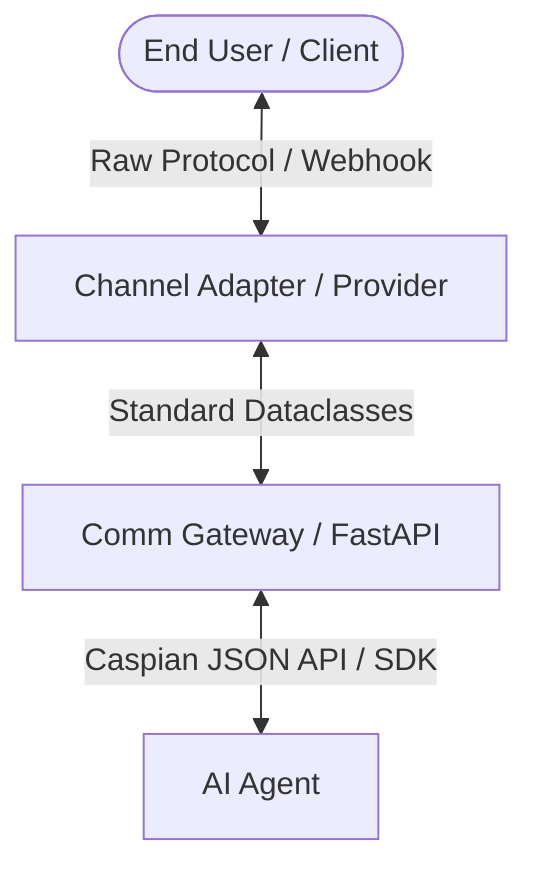

# Adapter Development Guide

This guide walks through the implementation patterns, interface contracts, and testing conventions for adding new channel adapters (also referred to as **providers**) to the Caspian Gateway.

All adapter code resides inside `server/src/comm_gateway/providers/`.

---

## 1. The Channel Lifecycle & Architecture

The Caspian Gateway normalizes all third-party messaging transports behind a single standard API. 



- **Inbound path:** The external messaging platform sends a webhook. The provider validates the webhook signature, extracts metadata/text, and normalizes it into `InboundMessage` objects.
- **Outbound path:** The agent requests a send/reply. The provider receives an `OutboundMessage` and translates it into the platform's specific API request formats.

---

## 2. Implementing the `ChannelProvider` Interface

Every provider must implement the `ChannelProvider` protocol defined in `server/src/comm_gateway/providers/base.py`:

```python
from collections.abc import Mapping
from comm_gateway.providers.base import (
    Capability,
    InboundMessage,
    OutboundMessage,
    ProvisionRequest,
    ProvisionResult,
    SendResult,
)

class MyChannelProvider:
    name = "my-channel-provider"  # Unique provider identifier (e.g., "telegram")
    channel = "my-channel"         # Target channel type (e.g., "telegram", "slack")
    capabilities = frozenset({
        Capability.RECEIVE,
        Capability.REPLY,
        Capability.SEND,
    })
    # List of connection-level credential keys required from developers (e.g., "bot_token")
    connect_credentials = ("api_key",)

    def __init__(self, some_global_setting: str = "") -> None:
        self._global_setting = some_global_setting

    def provision(self, request: ProvisionRequest) -> ProvisionResult:
        """Validate connection credentials and establish initial webhooks."""
        ...

    def send(
        self,
        provider_inbox_id: str,
        message: OutboundMessage,
        credentials: Mapping[str, str] | None = None,
    ) -> SendResult:
        """Send a new outbound message to a recipient."""
        ...

    def reply(
        self,
        provider_inbox_id: str,
        provider_message_id: str,
        message: OutboundMessage,
        credentials: Mapping[str, str] | None = None,
    ) -> SendResult:
        """Reply to an existing message using quote/thread semantics."""
        ...

    def parse_webhook(
        self,
        payload: bytes,
        headers: Mapping[str, str],
        credentials: Mapping[str, str] | None = None,
    ) -> list[InboundMessage]:
        """Verify webhook signature, parse payload, and normalize to InboundMessage."""
        ...
```

### Protocol Details

1. **`provision`**: Triggered when a new connection is registered. You must validate the supplied `credentials` (if any), register any webhook URLs with the external platform, and return a `ProvisionResult` containing:
   - `address`: The public identifier/handle for the connected account (e.g., `@MyBot`).
   - `provider_resource_id`: The immutable ID of the resource (e.g., Telegram bot ID).
2. **`send`**: Send a new message. `message.to` contains the recipient ID(s) (always message the first element, i.e., `message.to[0]`). Return `SendResult` containing the provider message ID.
3. **`reply`**: Send a threaded/quoted reply. `provider_message_id` represents the message being replied to.
4. **`parse_webhook`**: Extract message payloads. Because webhooks can be multi-tenant, the gateway will locate connection-specific `credentials` before calling this method.

---

## 3. Capability Declarations

Capabilities dictate what operations are offered. Caspian checks these properties before calling endpoints to ensure clear `422` error feedback instead of silent failure:

| Capability | Purpose |
| :--- | :--- |
| `Capability.RECEIVE` | Receive inbound messages. |
| `Capability.SEND` | Proactively message an existing conversation. |
| `Capability.REPLY` | Reply to a specific inbound message. |
| `Capability.INITIATE` | Initiate a cold-start conversation (e.g., cold outreach via SMS). |
| `Capability.GROUP_VISIBILITY` | Access all messages in group chats, not just direct mentions. |
| `Capability.INTERACTIONS` | Round-trip interactive elements like button taps back to the agent. |
| `Capability.MEDIA` | Send and receive media attachments. |
| `Capability.REACTIONS` | Send and receive emoji reactions. |

---

## 4. Inbound Verification

Webhooks **must** be verified to prevent impersonation. If the platform signs webhooks, enforce signature checking inside `parse_webhook` and raise `WebhookVerificationError` on mismatch:

```python
import hmac
import hashlib
from comm_gateway.providers.base import WebhookVerificationError, lower_headers

def parse_webhook(self, payload: bytes, headers: Mapping[str, str], credentials: Mapping[str, str] | None = None) -> list[InboundMessage]:
    # 1. Normalize headers (header names are case-insensitive)
    folded_headers = lower_headers(headers)
    signature = folded_headers.get("x-platform-signature")
    
    # 2. Timing-safe verification
    expected = hmac.new(self._webhook_secret.encode(), payload, hashlib.sha256).hexdigest()
    if not hmac.compare_digest(signature, expected):
        raise WebhookVerificationError("Signature verification failed")
```

---

## 5. Inbound Message Normalization

Always populate standard fields in `InboundMessage`:

- **`external_event_id`**: Globally unique ID for this event (prevents double-processing).
- **`provider_inbox_id`**: The target inbox (bot ID / account number).
- **`provider_message_id`**: Unique message ID. For threading/replies, we often format this as a composite ID (e.g. `"{thread_id}:{message_id}"` or `"{thread_id}:{timestamp}:{sender}"`).
- **`provider_thread_id`**: The chat/channel/thread room ID.
- **`sender_address`**: The address of the sender.
- **`sender_name`**: The human-readable name of the sender.
- **`chat_type`**: `"private"`, `"group"`, or `"channel"`.
- **`kind`**: `"message"`, `"interaction"` (button taps), or `"reaction"`.

---

## 6. Fake Provider Implementation

Each real provider requires a companion fake provider (e.g., `FakeMyChannelProvider`) placed in the same module or under `comm_gateway/providers/fakes/`. Fakes enable offline integration testing by:

- Simulating connection provisioning without external HTTP calls.
- Storing sent messages and replies in a local list so tests can inspect them.
- Providing a helper method (e.g., `webhook_payload`) to generate mock payloads matching the platform's exact webhook structure.

```python
class FakeMyChannelProvider:
    name = "fake-my-channel"
    channel = "my-channel"
    capabilities = MyChannelProvider.capabilities

    def __init__(self, number: str = "+12345") -> None:
        self._number = number
        self.sent = []

    def provision(self, request: ProvisionRequest) -> ProvisionResult:
        return ProvisionResult(address=self._number, provider_resource_id=self._number)

    def send(self, provider_inbox_id: str, message: OutboundMessage, credentials=None) -> SendResult:
        self.sent.append({"to": message.to, "text": message.text})
        return SendResult(provider_message_id="msg123", provider_thread_id="thread123")
```

---

## 7. Registry and Configuration Updates

To integrate your provider into the gateway:

1. **`server/src/comm_gateway/config.py`**:
   Add environment variables inside `Settings` (prefix `COMM_` automatically handled by Pydantic):
   ```python
   my_channel_api_url: str = "https://api.mychannel.com"
   my_channel_webhook_secret: str = ""
   ```

2. **`server/src/comm_gateway/providers/registry.py`**:
   Import and initialize your provider inside `_build_one()`:
   ```python
   if name == "my-channel":
       from .my_channel import MyChannelProvider
       return MyChannelProvider(api_url=settings.my_channel_api_url)
   ```

---

## 8. Reference Adapters by Transport Type

When building a new adapter, refer to these existing implementations as templates:

- **Webhook / HTTP APIs**:
  - `slack.py`: Complex blocks, OAuth connection flow, media attachments, and interactive button taps.
  - `telegram.py`: Multi-tenant webhooks, emoji reactions, and inline keyboard rendering.
  - `x.py`: OAuth 1.0a signatures, direct-message polling, and webhook CRC challenges.
- **TCP / Socket / Daemons**:
  - `signal.py`: Standard daemon connection patterns using Unix sockets, TCP sockets, or HTTP.
  - `modem.py`: Direct hardware serial communication (`pyserial`).
- **Email / SMTP**:
  - `ses.py`: AWS SES outbound mailing and S3/SNS-driven inbound webhook parsing.

---

## 9. Testing Guidelines

Tests go in `server/tests/` and are named `test_<channel>.py`. Your test suite should cover:

1. **Webhook Normalization**: Use the fake provider's `webhook_payload()` helper to generate mock raw payloads and verify they map to the correct `InboundMessage` fields.
2. **Signature Rejection**: Verify that bad signatures, missing tokens, or tempered payloads raise `WebhookVerificationError`.
3. **Outbound Messaging**: Mock outgoing HTTP calls (using `httpx.MockTransport`) or mock socket connections (using `unittest.mock.patch`) to ensure your adapter formats calls to the external API correctly.
4. **Fake Provider Verification**: Confirm the fake provider accurately provisions, stores sends, and logs replies.
