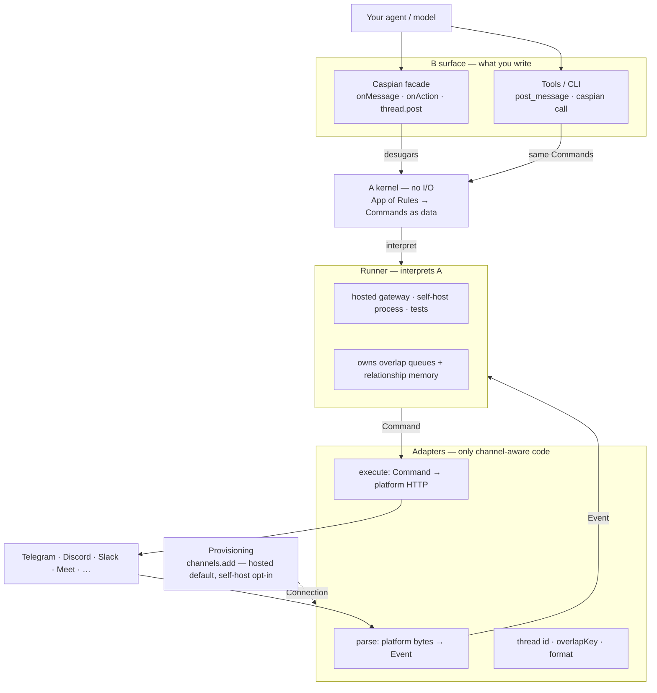

# Architecture

Caspian is an agent-communication SDK: your model decides what to say; Caspian is how that agent exists on Slack, Discord, Telegram, Meet, and the rest. The rewrite splits that into a Chat SDK-shaped public API (**B**) that desugars into a small, inspectable kernel (**A**). Developers write `onMessage` / `onAction` and `thread.post`; underneath, that becomes an `App` — a list of Rules (when this Event matches, with this overlap policy, emit these Commands). The kernel is pure: it maps `(state, event, app)` to Commands as data, with no network, clocks, or platform names. Channel adapters are the only code that knows a platform; they parse inbound bytes into Events, execute Commands, encode thread ids, and choose the overlap key. A runner — in-memory for tests, your process when self-hosting, Caspian's gateway when hosted — interprets those Commands and owns overlap queues and relationship memory. Provisioning (`channels.add`) is paperwork beside the program, not inside it: hosted identity and inbound are the default; `via: "self-host"` is the opt-in. Tools and the CLI are another view of the same Commands, so a coding agent and a bot handler speak one language.

