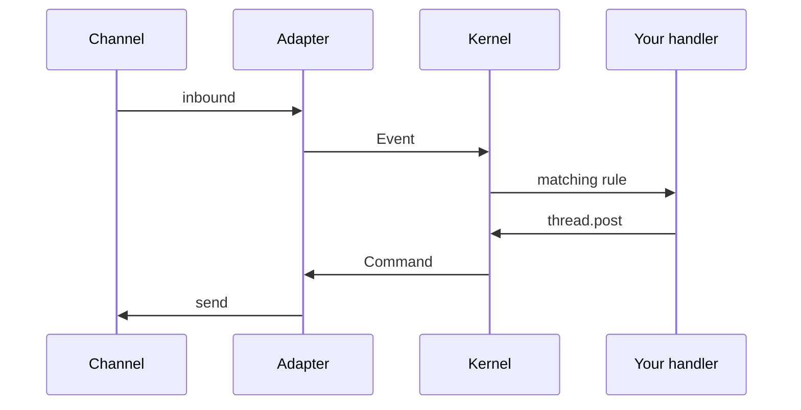
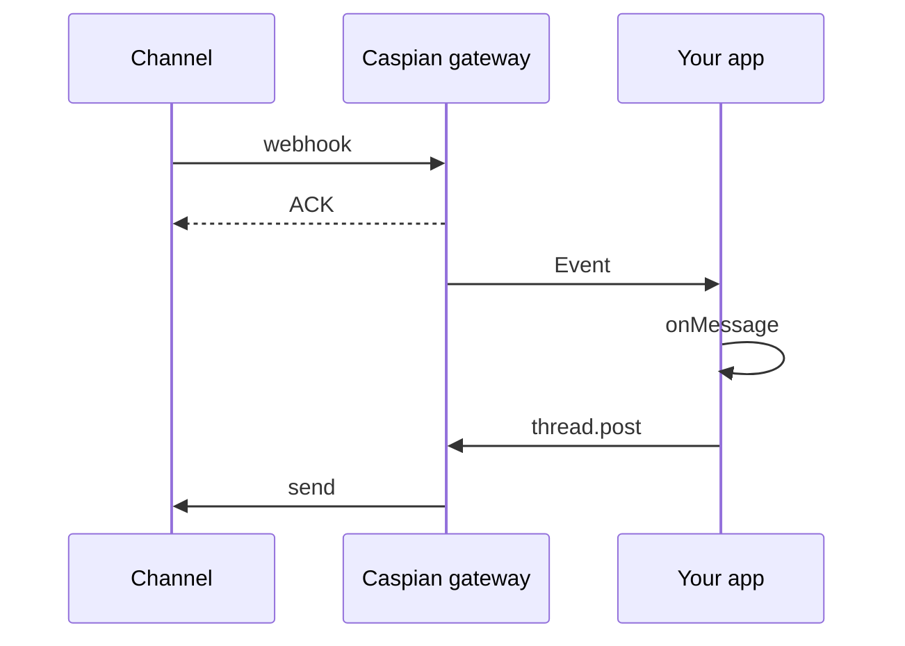
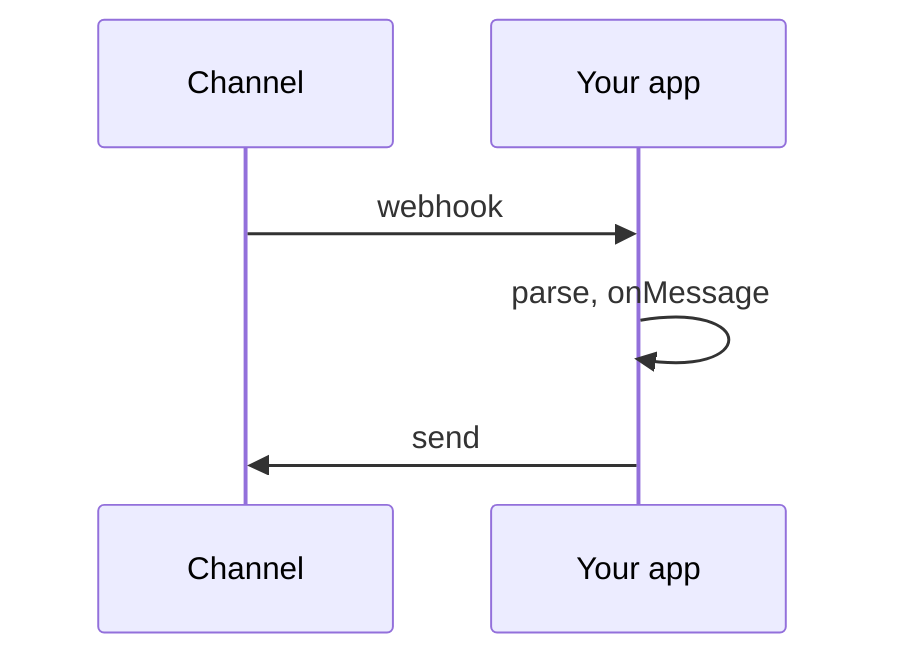

# Architecture

You write `onMessage` and `thread.post`. Caspian turns that into a list of rules the kernel can test without talking to Slack or Telegram. Adapters are the only code that knows a channel. A runner — our gateway, your process, or a test — sends the messages and remembers the conversation. Hosted is the default; self-host is opt-in.

## A turn

Every message takes the same path. The adapter translates; the kernel decides; your handler replies.

## Hosted

The platform talks to Caspian, not to you. Caspian ACKs immediately, then delivers the event to your app.

## Self-host

The platform hits your webhook. Same kernel, no Caspian in the middle.

